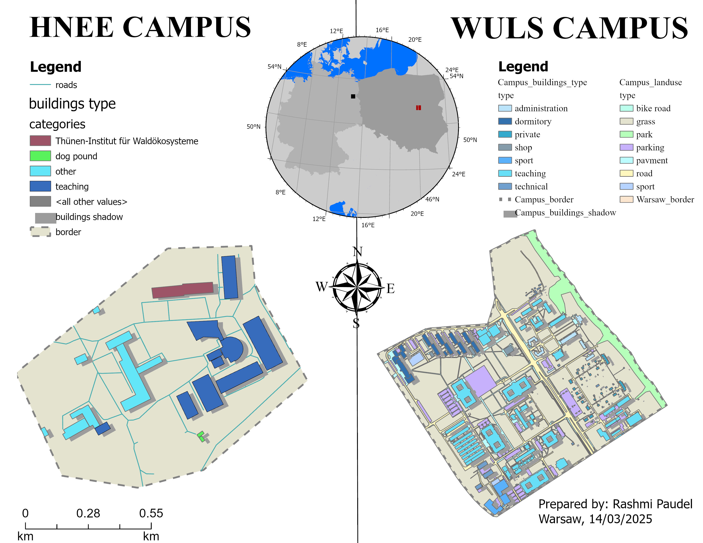
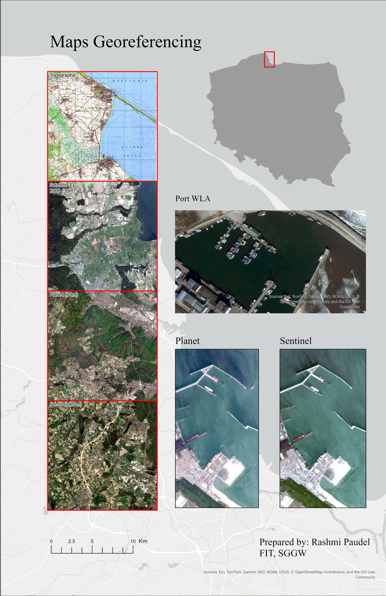

# GIS-Visualization-Maps
This repository consist of all the maps visualization work I have worked on using ARC GIS pro.

Below are the maps with brief descriptions:

### 1. HNEE_and_WULS_university_visualization_map

**Description:** This map shows ...

---

### 2. Georeferenced map of poland

**Description:** This map shows ...

---

### 3. Accuracy Assessment of GNSS Receiver (Stonex) VS Mobile
_VS_mobile.jpg)

**Description:** This map shows ...

---

*(Repeat for all maps)*

---

## 🛠 Tools Used
- ArcGIS Pro
- Python (for spatial data analysis)
- QGIS